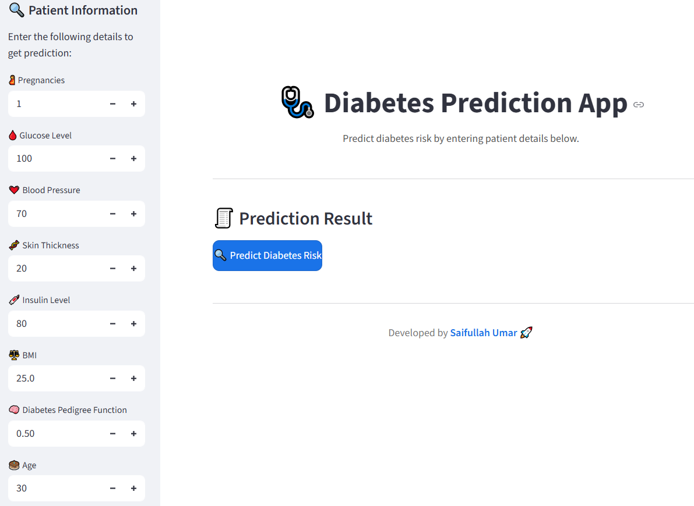
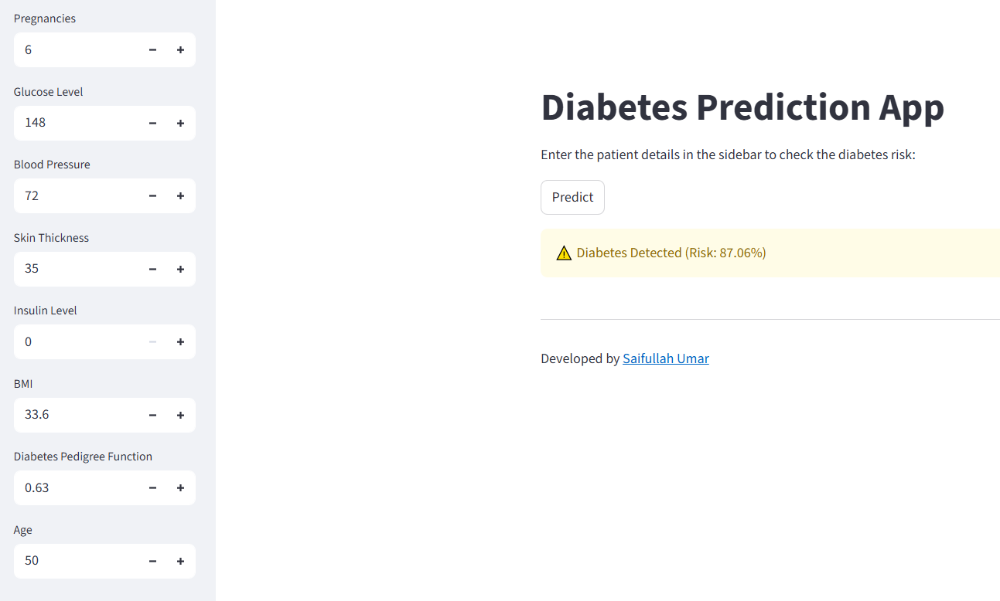

# 🩺 Diabetes Prediction App

A **Machine Learning–powered web application** built during my **CodeAlpha Internship** to predict whether a patient is likely to have diabetes based on medical details such as glucose level, blood pressure, BMI, and age.

This project uses **classification algorithms** (Decision Tree, Random Forest, KNN, and SVM) with **GridSearchCV** for hyperparameter tuning and is deployed with an interactive **Streamlit** web interface.

---

## 🚀 Features

- 🧠 **Trained ML Model:** Predicts diabetes using patient health data.  
- ⚙️ **Automated Model Selection:** Uses `GridSearchCV` to find the best performing classifier.  
- ⚖️ **Balanced Dataset:** Handled class imbalance using `SMOTE`.  
- 📊 **Feature Analysis:** Performed correlation and mutual information analysis.  
- 🌐 **User-Friendly Web App:** Built with Streamlit and styled with custom CSS.  
- 💾 **Model Persistence:** Trained model and scaler are saved using `joblib`.  

---

## 📂 File Description

| File | Description |
|------|-------------|
| `diabetes.csv` | Dataset used for training and testing the model. |
| `main.py` | Contains data preprocessing, training, tuning, and model saving code. |
| `interface.py` | Streamlit UI file for user interaction and predictions. |
| `Scaler.pkl` | Saved MinMaxScaler object for input feature scaling. |
| `Diabetes pedictor model.pkl` | Trained and optimized ML model file. |
| `README.md` | Project documentation (this file). |

---

## 🧩 Tech Stack

**Languages & Libraries:**
- Python  
- Pandas, NumPy  
- Scikit-Learn, Imbalanced-Learn  
- Matplotlib, Seaborn  
- Streamlit  
- Joblib  

---

## 📊 Machine Learning Pipeline

1. **Data Loading:**  
   Load the Pima Indians Diabetes dataset (`diabetes.csv`).

2. **EDA (Exploratory Data Analysis):**  
   - Checked for missing and duplicate values.  
   - Examined correlations using heatmaps.  
   - Used Mutual Information to determine feature relevance.

3. **Feature Scaling:**  
   Scaled numerical features using `MinMaxScaler`.

4. **Balancing:**  
   Used `SMOTE` to oversample the minority class.

5. **Model Selection & Tuning:**  
   Used `GridSearchCV` to tune hyperparameters for:
   - Decision Tree  
   - KNN  
   - Random Forest  
   - SVM  

6. **Evaluation Metrics:**  
   - Confusion Matrix  
   - Accuracy, Precision, Recall, F1 Score  

7. **Model Saving:**  
   Saved the best model and scaler using `joblib`.

8. **Deployment (Streamlit UI):**  
   Built an interactive UI where users can input health details and get instant predictions.

---

## 🧠 Best Model Selection Example Output

| Model | Best Parameters | CV Score |
|--------|----------------|-----------|
| DecisionTree | {'criterion': 'entropy', 'max_depth': 7, 'min_samples_split': 2} | 0.88 |
| KNN | {'n_neighbors': 8} | 0.84 |
| RandomForest | {'n_estimators': 200, 'max_depth': 9, 'min_samples_split': 2} | 0.91 |
| SVC | {'C': 10, 'gamma': 1} | **0.92** ✅ |

> The model with the highest CV score was selected as the **final model**.

---

## 💻 Installation & Setup

### 1. Clone the Repository
```bash
git clone https://github.com/SaifUllahUmar0317/diabetes-prediction-app.git
cd diabetes-prediction-app
```

### 2. Create Virtual Environment (optional but recommended)
```bash
python -m venv venv
venv\Scripts\activate    # For Windows
source venv/bin/activate # For Linux/Mac
```

### 3. Install Dependencies
```bash
pip install -r requirements.txt
```

**Or manually:**
```bash
pip install pandas numpy scikit-learn matplotlib seaborn streamlit imbalanced-learn joblib
```

### 4. Run the Streamlit App
```bash
streamlit run interface.py
```

The web app will automatically open in your browser at:  
👉 http://localhost:8501

---

## 📱 App Overview

### 🩸 Input Fields

Users can input:

- Pregnancies  
- Glucose  
- Blood Pressure  
- Skin Thickness  
- Insulin  
- BMI  
- Diabetes Pedigree Function  
- Age  

---

### 🧾 Prediction Result

Displays:

- ✅ **No Diabetes Detected** (with risk probability)  
- ⚠️ **Diabetes Detected** (with risk probability)  

---

## 🖼️ Screenshots (Add after running app)

| App Section | Preview |
|--------------|----------|
| Home Page |  |
| Prediction Result |  |

---

## 📚 Dataset Information

The dataset used is the **Pima Indians Diabetes Database**, containing:

- **768 rows** and **9 columns**  
- **Features:** Pregnancies, Glucose, BloodPressure, SkinThickness, Insulin, BMI, DiabetesPedigreeFunction, Age  
- **Target:** Outcome (0 = No Diabetes, 1 = Diabetes)  

**Source:** [Kaggle - Pima Indians Diabetes Database](https://www.kaggle.com/datasets/uciml/pima-indians-diabetes-database)

---

## 🧑‍💻 Author

**👨‍💻 Saif Ullah Umar**  
Intern @ **CodeAlpha**  
🔗 [GitHub Profile](https://github.com/SaifUllahUmar0317)

---

## 📜 License

This project is open-source under the **MIT License**.  
Feel free to use, modify, and share it for learning purposes.
